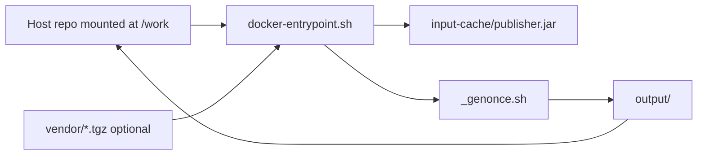

# Docker build environment for NkrIG

This repository includes a Linux container image with the tooling required to build the FHIR Implementation Guide locally, without installing Java, SUSHI, Jekyll, or Graphviz on your host machine.

The image is aligned with [`.github/workflows/main.yaml`](.github/workflows/main.yaml) (Ubuntu, Java 21, Node.js, SUSHI, Jekyll, Graphviz, IG Publisher).

## Prerequisites on your host

- [Docker Desktop](https://www.docker.com/products/docker-desktop/) (Windows or macOS), or Docker Engine on Linux
- On **Windows**: enable the **WSL2** backend in Docker Desktop
- **Network access** during builds (terminology server `tx.fhir.org`, HL7/Simplifier package downloads)

You do **not** need Java, Node, SUSHI, or Jekyll installed on Windows when using this workflow.

## What is included in the image

| Component | Purpose |
|-----------|---------|
| Ubuntu 22.04 | Base OS (same family as CI) |
| Eclipse Temurin JDK 21 | Runs the HL7 IG Publisher |
| Node.js 22 + SUSHI (`fsh-sushi`) | Compiles FSH sources to `fsh-generated/` |
| Jekyll + Graphviz | HTML generation for the published IG |
| `curl`, `git` | Scripts and package downloads |
| IG Publisher JAR | Pre-downloaded to `/opt/ig-publisher/publisher.jar` |

On each container start, the entrypoint script ([`scripts/docker-entrypoint.sh`](scripts/docker-entrypoint.sh)):

1. Copies `publisher.jar` into `input-cache/` if it is missing
2. Installs Nictiz snapshot packages from `vendor/*.tgz` (when present)
3. Normalizes Windows line endings on `_genonce.sh`, `_gencontinuous.sh`, and `_updatePublisher.sh`

## Repository layout (Docker-related files)

| File | Description |
|------|-------------|
| [`Dockerfile`](Dockerfile) | Image definition |
| [`docker-compose.yml`](docker-compose.yml) | Compose services for build, watch, and publisher update |
| [`scripts/docker-entrypoint.sh`](scripts/docker-entrypoint.sh) | Startup preparation |
| [`vendor/`](vendor/) | Optional local Nictiz snapshot packages (not in git) |
| [`.dockerignore`](.dockerignore) | Excludes build artifacts from the image build context |

## Quick start

Open a terminal in the repository root (PowerShell, cmd, or WSL).

### 1. Build the image (once)

```powershell
cd "c:\Repositories\FHIR Profiling and implementation guide\NkrIG"
docker compose build ig-build
```

This creates the image `nkrig-builder:latest`. Only the `ig-build` service defines `build:`; other services reuse the same image.

### 2. (Recommended) Add Nictiz snapshot packages

SUSHI depends on Nictiz packages that must include **snapshots**. Without them, you may see errors such as:

> Structure Definition … is missing a snapshot. Snapshot is required for import.

Download the packages **with snapshots** from [Simplifier](https://simplifier.net/) and place the `.tgz` files in the `vendor/` folder. Expected names (versions must match [`sushi-config.yaml`](sushi-config.yaml)):

| File in `vendor/` | Package |
|-------------------|---------|
| `nictiz.fhir.nl.r4.nl-core-0.12.0-beta.4-snapshots.tgz` | nl-core |
| `nictiz.fhir.nl.r4.zib2020-0.12.0-beta.4-snapshots.tgz` | zib2020 |
| `nictiz.fhir.nl.r4.medicationprocess9-2.0.0-rc.7-snapshots.tgz` | medicationprocess9 |

The entrypoint also accepts similar filenames matching `vendor/nictiz.fhir.nl.r4.*-*-snapshots.tgz`.

If `vendor/` is empty, SUSHI will try to download dependencies from the registry; snapshot-related failures are then possible (see [README.md](README.md) troubleshooting).

### 3. Run a one-off IG build

```powershell
docker compose run --rm ig-build
```

This runs `./_genonce.sh` inside the container. Output is written to your working copy:

- `fsh-generated/` — SUSHI output (gitignored)
- `input-cache/` — IG Publisher JAR (gitignored)
- `output/` — published IG (gitignored)

### 4. Watch mode (rebuild on file changes)

```powershell
docker compose run --rm ig-watch
```

Runs `./_gencontinuous.sh` (equivalent to `_genonce.sh -watch`).

### 5. Update the IG Publisher in the repo

```powershell
docker compose run --rm ig-update-publisher
```

Runs `./_updatePublisher.sh -y` to refresh `publisher.jar` and optionally update helper scripts.

### 6. Generate a SUSHI-only package

This runs **only** the SUSHI compiler and assembles a FHIR package aligned with the IG Publisher `package/` layout:

- `StructureDefinition-*.json` and `ImplementationGuide-*.json` at the package root
- `example/` with `Bundle-*.json` example instances (same bundles as the full IG build)
- `.index.json` package index (`.index.db` is not created)

```powershell
docker compose run --rm ig-sushi-package
```

Outputs are written to:

- `sushi-generated-packages/<packageId>#<version>/package/` (unpacked package folder)
- `sushi-generated-packages/<packageId>#<version>/<packageId>-<version>.tgz` (tarball)

`packageId` and `version` are taken from [`sushi-config.yaml`](sushi-config.yaml).

## Docker Compose services

| Service | Command | Use when |
|---------|---------|----------|
| `ig-build` | `./_genonce.sh` | Single full build |
| `ig-sushi-package` | `./scripts/sushi-package.sh` | Create a SUSHI-only package (profiles, examples, index) |
| `ig-watch` | `./_gencontinuous.sh` | Continuous rebuild while editing |
| `ig-update-publisher` | `./_updatePublisher.sh -y` | Refresh publisher JAR / scripts |

All services mount the repository at `/work` so edits on the host are visible inside the container.

## Alternative: plain Docker (without Compose)

```bash
docker build -t nkrig-builder .
docker run --rm -it -v "${PWD}:/work" -w /work nkrig-builder ./_genonce.sh
```

On Windows PowerShell, use the full path for the volume:

```powershell
docker run --rm -it -v "${PWD}:/work" -w /work nkrig-builder ./_genonce.sh
```

## How it works



1. **Build image** — installs OS packages and tooling; downloads `publisher.jar` into the image.
2. **Run container** — entrypoint prepares `input-cache/` and `~/.fhir/packages/` from `vendor/`.
3. **`_genonce.sh`** — checks connectivity to `tx.fhir.org`, then runs the IG Publisher on the mounted repo.

## Troubleshooting

### `bash\r: No such file or directory`

Shell scripts were saved with Windows (CRLF) line endings. The entrypoint strips `\r` from `_genonce.sh` and related scripts on each run. Ensure [`scripts/docker-entrypoint.sh`](scripts/docker-entrypoint.sh) itself uses LF (see [`.gitattributes`](.gitattributes)).

### IG Publisher not found

Run a build once so the entrypoint can create `input-cache/publisher.jar`, or run:

```powershell
docker compose run --rm ig-update-publisher
```

### Missing snapshot errors from SUSHI

Add the three Nictiz snapshot `.tgz` files to `vendor/` (see step 2 above), then re-run `docker compose run --rm ig-build`.

### Offline / terminology server unavailable

`_genonce.sh` detects offline mode and passes `-tx n/a` to the publisher. Some validation features may be limited.

### Build fails without network

The publisher and SUSHI need internet access for terminology, templates, and dependency packages (unless everything is already cached under `~/.fhir/packages` inside the container; that cache is **not** persisted between runs unless you add a volume for it).

### Image size

The image is roughly **1–2 GB** (Jekyll/Ruby, Java, Node, and the ~100 MB publisher JAR). This is normal for FHIR IG tooling.

### Rebuild after Dockerfile changes

```powershell
docker compose build --no-cache ig-build
```

## Windows-specific notes

- Use **Docker Desktop** with the WSL2 integration enabled.
- Prefer running `docker compose` from PowerShell or Windows Terminal in the repo directory.
- Generated folders (`output/`, `fsh-generated/`, `input-cache/`) appear on the Windows filesystem via the bind mount.
- You do **not** need WSL or Git Bash to run `_genonce.sh` on the host when using Docker; the container provides bash.

## Comparison with local installation

| Approach | Pros | Cons |
|----------|------|------|
| **Docker (this guide)** | Reproducible; matches CI stack; no local Java/Jekyll setup | Large image; first build downloads dependencies |
| **Local / WSL** ([README.md](README.md)) | Faster iteration once configured | Manual install of Java, Node, SUSHI, Jekyll, Graphviz |

## Further reading

- [README.md](README.md) — project overview and manual setup
- [FSH / SUSHI](https://fshschool.org/docs/sushi/)
- [HL7 IG Publisher](https://confluence.hl7.org/display/FHIR/IG+Publisher+Documentation)
