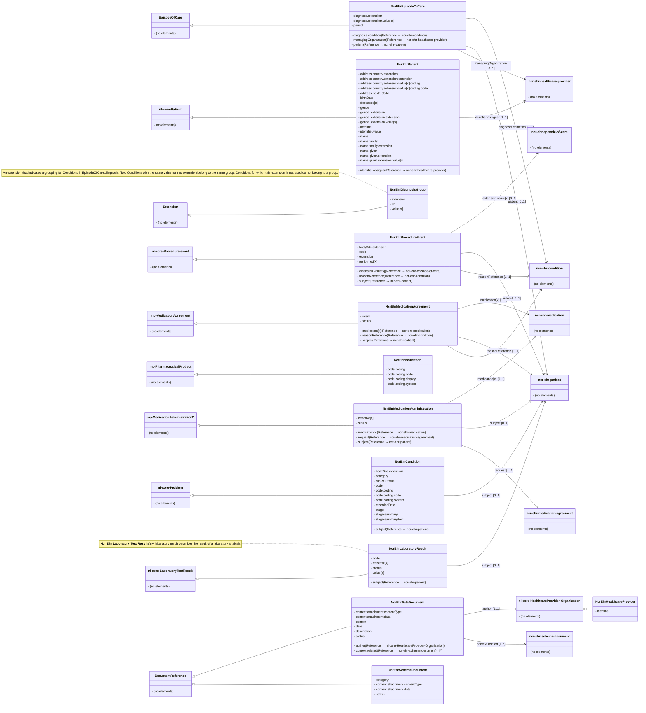

# StructureDefinitions (Mermaid)

```mermaid
classDiagram
direction LR
class DocumentReference["DocumentReference"] {
  - (no elements)
}

class EpisodeOfCare["EpisodeOfCare"] {
  - (no elements)
}

class Extension["Extension"] {
  - (no elements)
}

class NcrEhrCondition["NcrEhrCondition"] {
  - bodySite.extension
  - category
  - clinicalStatus
  - code
  - code.coding
  - code.coding.code
  - code.coding.system
  - recordedDate
  - stage
  - stage.summary
  - stage.summary.text
  - subject (Reference → ncr-ehr-patient)
}

class NcrEhrDataDocument["NcrEhrDataDocument"] {
  - author (Reference → nl-core-HealthcareProvider-Organization)
  - content.attachment.contentType
  - content.attachment.data
  - context
  - context.related (Reference → ncr-ehr-schema-document)[*]
  - date
  - description
  - status
}

class NcrEhrDiagnosisGroup["NcrEhrDiagnosisGroup"] {
  - extension
  - url
  - value[x]
}

class NcrEhrEpisodeOfCare["NcrEhrEpisodeOfCare"] {
  - diagnosis.condition (Reference → ncr-ehr-condition)
  - diagnosis.extension
  - diagnosis.extension.value[x]
  - managingOrganization (Reference → ncr-ehr-healthcare-provider)
  - patient (Reference → ncr-ehr-patient)
  - period
}

class NcrEhrHealthcareProvider["NcrEhrHealthcareProvider"] {
  - identifier
}

class NcrEhrLaboratoryResult["NcrEhrLaboratoryResult"] {
  - code
  - effective[x]
  - status
  - subject (Reference → ncr-ehr-patient)
  - value[x]
}

class NcrEhrMedication["NcrEhrMedication"] {
  - code.coding
  - code.coding.code
  - code.coding.display
  - code.coding.system
}

class NcrEhrMedicationAdministration["NcrEhrMedicationAdministration"] {
  - effective[x]
  - medication[x] (Reference → ncr-ehr-medication)
  - request (Reference → ncr-ehr-medication-agreement)
  - status
  - subject (Reference → ncr-ehr-patient)
}

class NcrEhrMedicationAgreement["NcrEhrMedicationAgreement"] {
  - intent
  - medication[x] (Reference → ncr-ehr-medication)
  - reasonReference (Reference → ncr-ehr-condition)
  - status
  - subject (Reference → ncr-ehr-patient)
}

class NcrEhrPatient["NcrEhrPatient"] {
  - address.country.extension
  - address.country.extension.extension
  - address.country.extension.value[x].coding
  - address.country.extension.value[x].coding.code
  - address.postalCode
  - birthDate
  - deceased[x]
  - gender
  - gender.extension
  - gender.extension.extension
  - gender.extension.value[x]
  - identifier
  - identifier.assigner (Reference → ncr-ehr-healthcare-provider)
  - identifier.value
  - name
  - name.family
  - name.family.extension
  - name.given
  - name.given.extension
  - name.given.extension.value[x]
}

class NcrEhrProcedureEvent["NcrEhrProcedureEvent"] {
  - bodySite.extension
  - code
  - extension
  - extension.value[x] (Reference → ncr-ehr-episode-of-care)
  - performed[x]
  - reasonReference (Reference → ncr-ehr-condition)
  - subject (Reference → ncr-ehr-patient)
}

class NcrEhrSchemaDocument["NcrEhrSchemaDocument"] {
  - category
  - content.attachment.contentType
  - content.attachment.data
  - status
}

class mp_MedicationAdministration2["mp-MedicationAdministration2"] {
  - (no elements)
}

class mp_MedicationAgreement["mp-MedicationAgreement"] {
  - (no elements)
}

class mp_PharmaceuticalProduct["mp-PharmaceuticalProduct"] {
  - (no elements)
}

class ncr_ehr_condition["ncr-ehr-condition"] {
  - (no elements)
}

class ncr_ehr_episode_of_care["ncr-ehr-episode-of-care"] {
  - (no elements)
}

class ncr_ehr_healthcare_provider["ncr-ehr-healthcare-provider"] {
  - (no elements)
}

class ncr_ehr_medication["ncr-ehr-medication"] {
  - (no elements)
}

class ncr_ehr_medication_agreement["ncr-ehr-medication-agreement"] {
  - (no elements)
}

class ncr_ehr_patient["ncr-ehr-patient"] {
  - (no elements)
}

class ncr_ehr_schema_document["ncr-ehr-schema-document"] {
  - (no elements)
}

class nl_core_HealthcareProvider_Organization["nl-core-HealthcareProvider-Organization"] {
  - (no elements)
}

class nl_core_LaboratoryTestResult["nl-core-LaboratoryTestResult"] {
  - (no elements)
}

class nl_core_Patient["nl-core-Patient"] {
  - (no elements)
}

class nl_core_Problem["nl-core-Problem"] {
  - (no elements)
}

class nl_core_Procedure_event["nl-core-Procedure-event"] {
  - (no elements)
}


note for NcrEhrDiagnosisGroup "An extension that indicates a grouping for Conditions in EpisodeOfCare.diagnosis. Two Conditions with the same value for this extension belong to the same group. Conditions for which this extension is not used do not belong to a group."
note for NcrEhrLaboratoryResult "**Ncr Ehr Laboratory Test Results**\nA laboratory result describes the result of a laboratory analysis"

nl_core_Problem <|-- NcrEhrCondition
DocumentReference <|-- NcrEhrDataDocument
Extension <|-- NcrEhrDiagnosisGroup
EpisodeOfCare <|-- NcrEhrEpisodeOfCare
nl_core_HealthcareProvider_Organization <|-- NcrEhrHealthcareProvider
nl_core_LaboratoryTestResult <|-- NcrEhrLaboratoryResult
mp_MedicationAdministration2 <|-- NcrEhrMedicationAdministration
mp_MedicationAgreement <|-- NcrEhrMedicationAgreement
mp_PharmaceuticalProduct <|-- NcrEhrMedication
nl_core_Patient <|-- NcrEhrPatient
nl_core_Procedure_event <|-- NcrEhrProcedureEvent
DocumentReference <|-- NcrEhrSchemaDocument
NcrEhrCondition --> ncr_ehr_patient : subject [0..1]
NcrEhrDataDocument --> nl_core_HealthcareProvider_Organization : author [1..1]
NcrEhrDataDocument --> ncr_ehr_schema_document : context.related [1..*]
NcrEhrEpisodeOfCare --> ncr_ehr_condition : diagnosis.condition [0..1]
NcrEhrEpisodeOfCare --> ncr_ehr_patient : patient [0..1]
NcrEhrEpisodeOfCare --> ncr_ehr_healthcare_provider : managingOrganization [0..1]
NcrEhrLaboratoryResult --> ncr_ehr_patient : subject [0..1]
NcrEhrMedicationAdministration --> ncr_ehr_medication : medication[x] [0..1]
NcrEhrMedicationAdministration --> ncr_ehr_patient : subject [0..1]
NcrEhrMedicationAdministration --> ncr_ehr_medication_agreement : request [1..1]
NcrEhrMedicationAgreement --> ncr_ehr_medication : medication[x] [1..1]
NcrEhrMedicationAgreement --> ncr_ehr_patient : subject [0..1]
NcrEhrMedicationAgreement --> ncr_ehr_condition : reasonReference [1..1]
NcrEhrPatient --> ncr_ehr_healthcare_provider : identifier.assigner [1..1]
NcrEhrProcedureEvent --> ncr_ehr_episode_of_care : extension.value[x] [0..1]
NcrEhrProcedureEvent --> ncr_ehr_patient : subject [0..1]
NcrEhrProcedureEvent --> ncr_ehr_condition : reasonReference [1..1]
```

